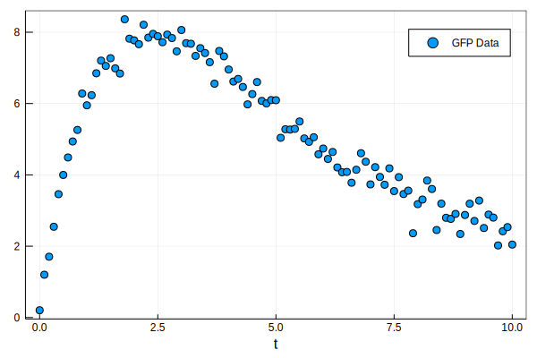
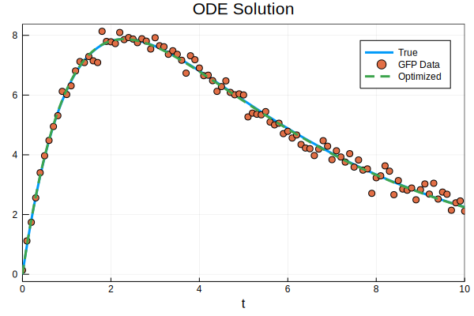

# Parameter Identifiability in ODE Models

## Conventional Parameter Optimization

### Observe a System and Gather Data

To illustrate a typical procedure for finding parameters to an ODE model, consider the system below where a green fluoresce protein (GFP) mRNA is inserted into a cell. The mRNA is translated by the ribosome in the cell to generate the the light emitting protein.


 We can use this system to determine how often GFP mRNA is read by measuring the light intensity given off by the cell. Here is some simulated data showing the dynamics of the GFP (arbitrary units):




Here we see the light intensity increase and slowly taper off, perhaps due to the cell degrading the mRNA over time. 

### Develop a Model to describe Observations

Based on our assumption about mRNA degrading over time we might develop a two-state ODE model that simulates protein and mRNA dynamics,
$$
\frac{dG(t)}{dt} = k\cdot m(t) - \beta \cdot G(t)\\
\frac{dm(t)}{dt} = - \tau \cdot m(t)\\
$$
subject to the following initial conditions:
$$
G(t=0) = 0\\
m(t=0) = m_0
$$


The model above consists of four unknown parameters $[k,\beta,\tau,m_0]$ with $m_0$ being the initial amount of GFP mRNA that entered the cell. Because this is such a simplistic model, we can derive an analytical solution to the system of ODEs.
$$
m(t) = m_0 e^{-\tau t}\\
G(t) = \frac{k \cdot m_0}{\beta-\tau} \left( e^{-\tau t} - e^{-\beta t} \right)
$$
There is an important side note to make here about **parameter identifiability**. We only have a measurement for $G(t)$ which mean $m_0$ and $k_{TL}$ cannot be uniquely determined, but there product ($m_0 \cdot k$) can be. This is a common occurrence in determining ODE parameter values  and is difficult to determine without the analytical solution.

### Determine the Best Fit

Using Julia, we can code the ODE model we can run an optimization routine to solve for the parameter values.

```julia
#Importing packages
	using DifferentialEquations, Random, Plots #Creating ODEs and Plotting
	using DiffEqParamEstim, Optim #For finding best fit parameters

###############################################
# Define the ODE Model
###############################################
#Using the fact that m(t) = exp(-τ*t)
    f = function(G,p,t)
        #Assign parameter values
        kTL, β, τ, m0 = p
        #Write the differential equation
        return kTL*m0*exp(-τ*t) - β*G
    end

#Parameter values, Initial Conditions, Time (start, end)
    p = [2.0, 0.8, 0.2, 5.0] #true parameter values
    u0 = 0.0
    tspan = (0.0,10.0)
#Contruct the ODE Problem
    prob = ODEProblem(f,u0,tspan,p)
#Solve the ODE problem and plot the solution (Tsit5 is a fancy ODE45)
    sol = solve(prob,Tsit5())
    plot(sol,title="ODE Solution",framestyle=:box,labels=:True)

###############################################
# Generate synthetic data to fit
###############################################

#Set a seed for reproducibility (same stream of random numbers every time)
	Random.seed!(0)
#Create a data set for optimization (adding random normal numbers)
	dataset = [(t,sol(t)+0.2randn()) for t in 0:0.1:10]
#Plot the data on top of the true solution
	scatter!(dataset,framestyle=:box,labels="GFP Data")

###############################################
# Create a cost function and optimize
###############################################

#Cost function
	dataTime = [d[1] for d in dataset] #Collect the time points
	dataValues = [d[2] for d in dataset] #Collect the GFP values
#The cost function needs a few inputs including the ODE probplem, ODE solver, and L2 error (i.e. sum of squared error)
	cost_function = build_loss_objective(prob,Tsit5(),L2Loss(dataTime,dataValues),
                                     maxiters=10000,verbose=false)
#Run the optimizer
	initialGuess = ones(4) #all parameters set to 1
	result = optimize(cost_function, initialGuess) 
#Plot the best parameters found
	probOpt = remake(prob,p=result.minimizer)
	sol = solve(probOpt,Tsit5())
	plot!(sol,labels=:Optimized,linestyle = :dash)
```



Because the noise added to the data was small, the optimizer was able to get within near perfect agreement of the true solution. How do the optimized parameterized values compare to the true values?

| Parameters | True | Initial | Optimized |
| :--------: | :--: | :-----: | :-------: |
|     k      | 2.0  |   1.0   |   2.91    |
|     β      | 0.8  |   1.0   |   0.19    |
|     τ      | 0.2  |   1.0   |   0.81    |
|     m0     | 5.0  |   1.0   |   3.45    |

As expected, the optimized values do not match the true values despite the good fit. The product ($m_0 \cdot k$) was preserved at a value of 10 and it even looks like the $\beta$ and $\tau$ parameters are non-identifiable as their values are swapped.

This rather simplistic ODE optimization problem demonstrates how much information can be lost when trying to retrieve parameter values and shows how **finding the one best parameter can be an ill-posed problem**.
