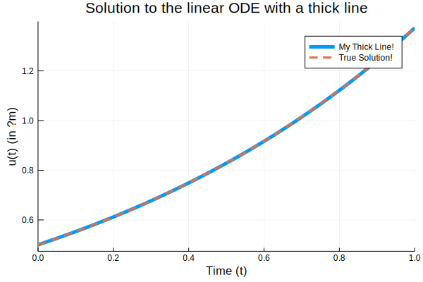

# Simulating ODEs in Julia

This is just a simple introduction to solving ordinary differential equations in the Julia language using the [DifferentialEquations.jl](http://docs.juliadiffeq.org/latest/index.html) suite.

$$
\begin{array}{c} \frac{dy_1}{dt}= f(t,y_1,y_2,...,y_n) \\ 
\frac{dy_2}{dt}= f(t,y_1,y_2,...,y_n) \\ 
\vdots \\
\frac{dy_n}{dt}= f(t,y_1,y_2,...,y_n)
\end{array}
$$

## Importing Packages

Most Julia sessions start with importing packages to allow the use of specialized functions beyond the basic within the language


```julia
using DifferentialEquations, Plots
```


```julia
f(u,p,t) = 1.01*u
u0=1/2
tspan = (0.0,1.0)
prob = ODEProblem(f,u0,tspan)
sol = solve(prob,Tsit5(),reltol=1e-8,abstol=1e-8)
using Plots
plot(sol,linewidth=5,title="Solution to the linear ODE with a thick line",
     xaxis="Time (t)",yaxis="u(t) (in μm)",label="My Thick Line!") # legend=false
plot!(sol.t, t->0.5*exp(1.01t),lw=3,ls=:dash,label="True Solution!")
```


